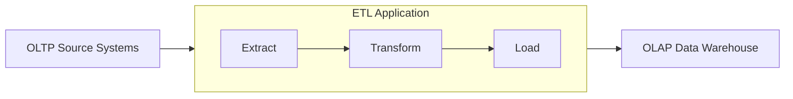

# Infrastructure as Code (IaC) для дата-инженера

## О видео

🔥 Устал создавать каждый DAG в Airflow вручную? В этом [видео](https://youtu.be/Wk_dXBdsoyc) я покажу, как
автоматизировать создание DAG-ов через Infrastructure as Code (IaC) подход! Разберём реальную фабрику DAG, которая
генерирует пайплайны на основе JSON и YAML конфигураций. Один конфиг-файл — и у тебя готовый DAG для переноса данных из
OLTP в OLAP!

Ссылки:

- Менторство/консультации по IT – https://korsak0v.notion.site/Data-Engineer-185c62fdf79345eb9da9928356884ea0
- TG канал – https://t.me/DataLikeQWERTY
- Instagram – https://www.instagram.com/i__korsakov/
- Habr – https://habr.com/ru/users/k0rsakov/publications/articles/

🔍 Что в ролике:

- 📊 Типовая задача дата-инженера: миграция OLTP → OLAP
- 🏭 Что такое фабрика DAG и зачем она нужна
- ⚙️ Настройка инфраструктуры Airflow через Docker
- 📝 Два варианта генерации: через JSON и YAML конфигурации
- 🎯 Пошаговый разбор кода DAG-генератора
- 💡 Боевые рекомендации: тесты, логирование, алертинг
- 🚀 Ready-to-use решение для твоих проектов!

🗂️ GitHub репозиторий с кодом: https://github.com/k0rsakov/pet_project_iac_etl_elt

📚 Мои статьи на Habr по теме:

- Генерация DAG в Apache Airflow – https://habr.com/ru/articles/722688/
- Таблица-справочник – генератор DAG? – https://habr.com/ru/articles/756978/

✉️ Заинтересован в обучении или есть вопросы? Пиши в
личку – https://korsak0v.notion.site/Data-Engineer-185c62fdf79345eb9da9928356884ea0

💡 В конце ролика — рекомендации как правильно внедрить фабрику DAG в production без боли и страданий!

Таймкоды:

- 00:00 – Начало
- 00:13 – Типичная задача дата-инженера и что такое фабрика ДАГов
- 05:52 – Про проект. Создание ДАГов через ДАГ
- 06:18 – Про инфраструктуру
- 07:15 – Конфигурация фабрики ДАГов
- 07:43 – Разбор генерации ДАГов через .json-конфигурацию
- 14:41 – Разбор генерации ДАГов через .yaml-конфигурацию
- 19:25 – Рекомендации

#airflow #dag #iac #infrastructureascode #dataengineering #etl #elt #python #json #yaml #docker #dataengineer
#apacheairflow #dagfactory #automation

## О проекте

Типовая задача дата-инженера – перенос данных из OLTP систем в OLAP системы.

Процесс в бо&#x0301;льшинстве случаев выглядит так:



Поэтому существует такое понятие как – Фабрика DAG.

Каждая команда её реализует по-своему, но основная цель у всех одна – упростить процесс подключения новых "источников".

Если раскрывать задачу, то для команды дата-инженеров важно:

- Единый верный подход подключения источника к OLAP системе.
- Лёгкий дебаг в случае падения пайплайна.
- Упрощённая разработка такой фабрики. К примеру, мы можем поменять один класс/метод/атрибут и у нас логика обновится во
  всех DAG.
- Упрощённый онбординг новых дата-инженеров.

Вариантов создания фабрики DAG множество.

Мои примеры:

- Создание физических файлов на основании
  шаблона – [Генерация DAG в Apache Airflow](https://habr.com/ru/articles/722688/)
- Создание "_виртуальных_" DAG на основании
  таблицы-справочника – [Таблица-справочник – генератор DAG? А что так можно было?](https://habr.com/ru/articles/756978/)

В данном проекте будет представлен ещё один вариант создания DAG – через DAG-генератор на основании конфигурационного
файла.

Рекомендации:

1) Покрывать функции тестами
2) Не пытаться сделать всемогущий DAG. Если выходит за "***паттерн***", то создайте руками вне фабрики и не мучайте
   генератор.
3) Генератор DAG / Фабрику DAG можно делать почти для любых задач. Но всё равно нужно следить за сложностью, чтобы в
   случае падения или изменения всё не сломалось.
4) Добавляйте больше логирования. Чем больше вы логов напишите – тем проще будет проходить дебаг. Что можно логировать:
    1) Количество строк в датафрейме.
    2) Количество строк добавленных/изменённых/удалённых в БД.
    3) Название временной таблицы.
    4) SQL-запрос для создания временной таблицы.
    5) Время локали и время по UTC.
    6) Этапы. `extract` ➡️ `transform` ➡️ `load` чтобы понимать на каком этапе упал ваш пайплайн.
    7) Логируйте хост и порт чтобы понимать на какой сервис обращаетесь (`dev`/`prod`/etc)
5) Не забывайте о алертинге об этом есть отдельное [видео](https://youtu.be/Fv_tLVlcc3A)
6) Не забывайте "*подчищать*" за собой. Потому что если создавать фабрику DAG, то в `stage` слое может быть "*грязно*"

### Настройка окружения для корректной работы Airflow

Airflow 2.10.4 у нас с Python3.12.8 (`>=3.12.8,<3.13`), поэтому виртуальное окружение необходимо создавать от
Python3.12:

```bash
python3.12 -m venv venv && \
source venv/bin/activate && \
pip install --upgrade pip && \
pip install poetry && \
poetry lock && \
poetry install
```

### Настройка Airflow через Docker

Мы используем Airflow, который собирается при помощи [Dockerfile](Dockerfile)
и [docker-compose.yaml](docker-compose.yaml).

Для запуска контейнера с Airflow, выполните команду:

```bash
docker-compose up -d
```

Веб-сервер Airflow запустится на хосте http://localhost:8080/, если не будет работать данный хост, то необходимо перейти
по хосту http://0.0.0.0:8080/.

#### Добавление пакетов в текущую сборку

Для того чтобы добавить какой-то пакет в текущую сборку, необходимо выполнить следующие шаги:

* Добавить новую строку в [Dockerfile](Dockerfile)
* Выполнить команду:

```bash
docker-compose build
```

* Выполнить команду:

```bash
docker-compose up -d
```