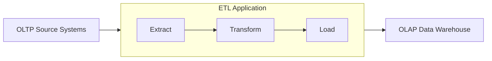

# Infrastructure as Code (IaC) для дата-инженера

## О видео

## О проекте

Типовая задача дата-инженера – перенос данных из OLTP систем в OLAP системы.

Процесс в бо&#x0301;льшинстве случаев выглядит так:



Поэтому существует такое понятие как – Фабрика DAG.

Каждая команда её реализует по-своему, но основная цель у всех одна – упростить процесс подключения новых "источников".

Если раскрывать задачу, то для команды дата-инженеров важно:

- Единый верный подход подключения источника к OLAP системе.
- Лёгкий дебаг в случае падения пайплайна.
- Упрощённая разработка такой фабрики. К примеру, мы можем поменять один класс/метод/атрибут и у нас логика обновится во
  всех DAG.
- Упрощённый онбординг новых дата-инженеров.

Вариантов создания фабрики DAG множество.

Мои примеры:

- Создание физических файлов на основании
  шаблона – [Генерация DAG в Apache Airflow](https://habr.com/ru/articles/722688/)
- Создание "_виртуальных_" DAG на основании
  таблицы-справочника – [Таблица-справочник – генератор DAG? А что так можно было?](https://habr.com/ru/articles/756978/)

В данном проекте будет представлен ещё один вариант создания DAG – через DAG-генератор на основании конфигурационного
файла.

### Настройка окружения для корректной работы Airflow

Airflow 2.10.4 у нас с Python3.12.8 (`>=3.12.8,<3.13`), поэтому виртуальное окружение необходимо создавать от
Python3.12:

```bash
python3.12 -m venv venv && \
source venv/bin/activate && \
pip install --upgrade pip && \
pip install poetry && \
poetry lock && \
poetry install
```

### Настройка Airflow через Docker

Мы используем Airflow, который собирается при помощи [Dockerfile](Dockerfile)
и [docker-compose.yaml](docker-compose.yaml).

Для запуска контейнера с Airflow, выполните команду:

```bash
docker-compose up -d
```

Веб-сервер Airflow запустится на хосте http://localhost:8080/, если не будет работать данный хост, то необходимо перейти
по хосту http://0.0.0.0:8080/.

#### Добавление пакетов в текущую сборку

Для того чтобы добавить какой-то пакет в текущую сборку, необходимо выполнить следующие шаги:

* Добавить новую строку в [Dockerfile](Dockerfile)
* Выполнить команду:

```bash
docker-compose build
```

* Выполнить команду:

```bash
docker-compose up -d
```